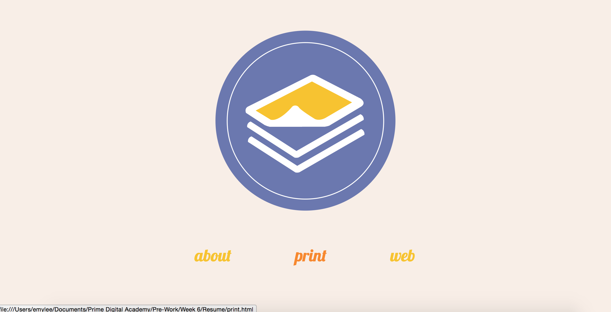
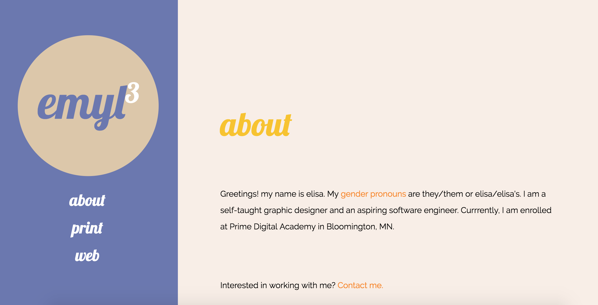
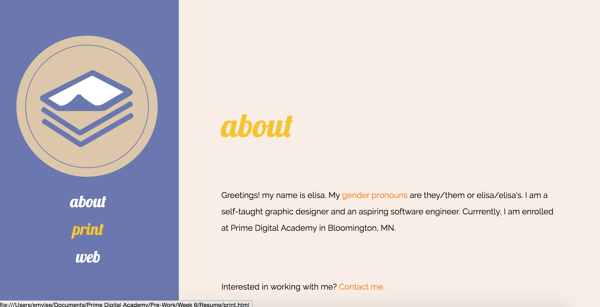
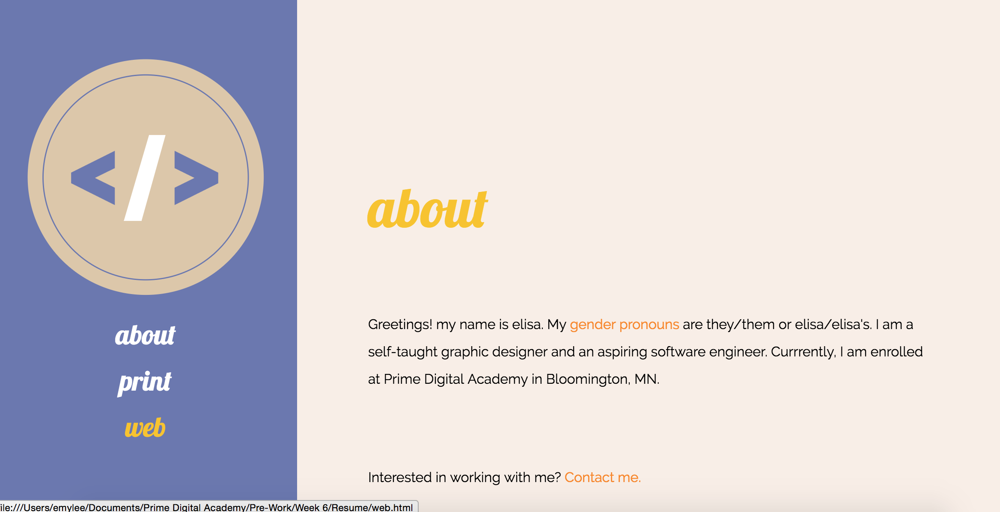

# Resume
This application was created before beginning the in-class portion of Prime Digital Academy in order to practice my first understanding of jQuery.

## Features
[Landing Page](#landing) | [Landing Page Options](#landingopt) | [About](#about) | [Navigation Bar](#navbar)

### <a name="landing">Landing Page</a>

Users are land on an interface with an "enter" button. When hovering over or clicking the "enter" button my profile picture appears.

### <a name="landingopt">Landing Page Options</a>

After clicking "enter," users are directed to three options "About" to learn more about me, "Print" to view more of my print designs (in progress), or "Web" to view my code (in progress).

### <a name="about">About</a>

Users can see information about me.

### <a name="navbar">Navigation Bar</a>

When hovering over the "Print" option in the navigation bar, a different image appears.

When hovering over the "Web" option in the navigation bar, a different image appears.

## Usage
<b>Technology Used</b>: HTML, CSS, jQuery

Fork the repository. Open the `landingPage.html` in a web browser.

# Author
- elisa lee
